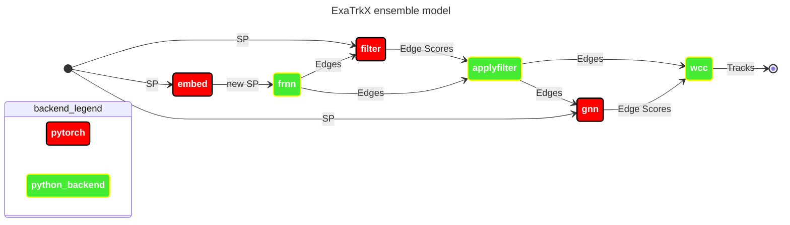

---
# try also 'default' to start simple
theme: seriph
# theme: neversink
# random image from a curated Unsplash collection by Anthony
# like them? see https://unsplash.com/collections/94734566/slidev
# background: https://atlas.cern/sites/default/files/2022-10/_DSC5418_0.jpeg 
background: /cover_background.jpg
# some information about your slides (markdown enabled)
title: NESAP-postdoc-seminar  
info: |

  The National Energy Research Scientific Computing Center ([NERSC](http://www.nersc.gov/about/)) at [Berkeley Lab](https://www.lbl.gov/) seeks a highly motivated Postdoctoral Fellow — HPC Scientific Workflows (NESAP @ NERSC) postdoctoral fellow to join the Workflow Readiness team as part of NERSC’s Exascale Science Acceleration Program ([NESAP](https://www.nersc.gov/what-we-do/support-for-scientists/nersc-science-acceleration-program)). You’ll work with NERSC staff, domain scientists, and engineers from industry partners to prepare key scientific workflows for the upcoming Doudna supercomputer across all [program areas](https://science.energy.gov/programs/) funded by the Department of Energy Office of Science. Doudna will deliver more than 10x the performance of Perlmutter and connect to DOE facilities for near-real-time data analysis. Your work will help 12,000+ users run faster, more reliable science.

  **What You Will Do:**
  - Contribute to one or more NESAP scientific workflows targeting NERSC HPC resources, edge resources, and the DOE ESnet network. 
  - Develop and apply advanced workflow capabilities to improve performance, portability, and productivity of scientific software. 
  - Publish and present results at peer-reviewed venues and conferences.

  **Example project areas**
  - Performance analysis and optimization of end-to-end scientific workflows, including those originating at DOE facilities. 
  - Operating persistent or ephemeral services supporting workflows, such as databases, workflow engines, cloud-native frameworks, AI inference front ends, and REST APIs. 
  - Coordinating dynamic service deployments and specifying storage QoS through new batch scheduler and REST API integrations. 
  - Building customized, containerized software environments for development, CI/CD, and external sharing. 
  - Using tools and templates for distributed AI training, agentic AI with modeling and simulation, and end-to-end workflow monitoring, profiling, and optimization. 
  - Working with quantum simulation tools, including NVIDIA CUDA-Q, to enable scalable quantum algorithm development and quantum-HPC codesign.

  **What is Required:**
  - PhD in Computer Science, Computational Science, Applied Mathematics, or a related field awarded within the last five years. 
  - Proficiency in at least one of Python, C++, Fortran, or Julia. 
  - Ability to work effectively in an interdisciplinary team. 
  - Demonstrated written and oral communication of candidate-led results

  **Desired Qualifications:**

  - Git and modern software practices such as unit testing, CI/CD, and collaborative development. 
  - Experience with HPC environments and batch schedulers like Slurm. 
  - REST API development or integration. 
  - Workflow orchestration tools. 
  - Data management with catalogs and transfer tools. 
  - Container technologies such as Docker, Podman, Shifter, or Apptainer. 
  - Kubernetes and cloud platforms.

  # A seminar given at NERSC for the workflow 
  ## **What You Will Do:**
  - Contribute to one or more NESAP scientific workflows targeting NERSC HPC resources, edge resources, and the DOE ESnet network. 
  - Develop and apply advanced workflow capabilities to improve performance, portability, and productivity of scientific software. 
  - Publish and present results at peer-reviewed venues and conferences.

# apply UnoCSS classes to the current slide
class: text-center
# https://sli.dev/features/drawing
drawings:
  persist: false
# slide transition: https://sli.dev/guide/animations.html#slide-transitions
transition: slide-left
# enable MDC Syntax: https://sli.dev/features/mdc
mdc: true
# duration of the presentation
duration: 45min

fonts:
  sans: 'LXGW WenKai'
routerMode: hash
---

# Scalable Inference-as-a-Service for Scientific Workflows
Lessons Learned from Triton and ATLAS-Scale Projects

<!-- A seminar on physics-driven analysis pipelines and ML at scale -->

<div class="mt-12 py-1" hover:bg="white op-10">
  Haoran Zhao, Ph.D. (Physics)  <br>
  NERSC NESAP Seminar, Jan 21, 2026
</div>

<!--
Hello everyone, good morning, and thank you so much for the invitation. My name is Haoran Zhao, and I’m a physicist. Today, I’m going to share some lessons I’ve learned from building scalable inference services for scientific workflows, and my experience in ATLAS projects. I’ll be focusing less on the physics details and more on the design choices, the trade-offs, and what actually works in practice.
-->

---
layout: two-cols
transition: fade-out
---

# Who am I?

How I approach physics, computing, and systems

<br>

- **Experimental Particle Physicist** — once hunted for charged Higgs bosons  
- **A long-time NERSC User** — from Cori to Perlmutter, looking forward to Doudna
- **Tinkerer** — build things to understand how they actually work  
- **Curious across domains** — physics, ML, DevOps, agentic AI, whatever breaks next

::right::

<div class="flex justify-center items-center h-full">
  
</div>

<style>
h1 {
  background-color: #2B90B6;
  background-image: linear-gradient(45deg, #4EC5D4 10%, #146b8c 20%);
  background-size: 100%;
  -webkit-background-clip: text;
  -moz-background-clip: text;
  -webkit-text-fill-color: transparent;
  -moz-text-fill-color: transparent;
}
</style>
<!-- 
So, just to briefly introduce myself: I was trained as an experimental particle physicist in ATLAS, and during my PhD I worked on searches for charged Higgs bosons. As an experimentalist, we test and validate theory through hands-on experiments, and large-scale computing is a core part of that work. I’ve been a long-time NERSC user, working on systems like Cori and Perlmutter, and I’m really looking forward to the next-generation flagship system at NERSC. I’m very grateful for the documentation, training events, and the user support provided by the NERSC User Group. I’m also very much a tinkerer at heart—I like to understand how tools actually work under the hood, and that naturally pushed me towards machine learning systems, inference pipelines, and workflow design.
 -->
---
layout: section
level: 1
background: https://home.cern/sites/default/files/2022-03/0807031_01-a4-at-144-dpi-min.jpg
---

# Intro to LHC and ATLAS

<!-- 
So, let me give you a quick introduction to the environment I’ve been working in.
 -->
---
layout: default-credit
level: 2
credit: "<a href='https://cds.cern.ch/images/OPEN-PHO-CHART-2015-001-1'>Credit</a>"
---

# Standard Model of Particle Physics
fundamental building blocks + interactions 

<div class="flex justify-center items-center">
  
</div>

<!-- 
In high-energy physics, we study the fundamental particles described by the Standard Model. We measure their properties, and we also search for signs of new physics beyond it.

To do this, we use two main components: a particle accelerator and a detector.
 -->
---
layout: default
level: 2
---

# Large Hadron Collider (LHC)
World’s largest and most powerful particle collider

<div class="flex justify-center gap-4 mt-14">
  
  
</div>
<!-- 
The Large Hadron Collider, or LHC, is the world’s largest and most powerful particle accelerator. It accelerates protons to nearly the speed of light and then collides them, allowing us to study particle interactions at extremely high energies.
-->

---
layout: default
level: 2
---

# ATLAS detector 
the largest general-purpose particle detector at LHC

<div class="flex justify-center gap-4 mt-14">
  
   
</div>


<!-- 
ATLAS is one of the large, general-purpose detectors at the LHC. You can think of it as a giant 3D camera that records what comes out of these collisions.
From the detector signals, we reconstruct physics objects. I want to briefly mention two of them, because they will show up later in the talk: particle tracks and jets.
Tracks are the trajectories left by charged particles as they pass through the detector, and jets are sprays of particles that originate from quarks or gluons. These are some of the basic building blocks of our analyses, and each collision event can produce a large number of them.
 -->

---
layout: image
level: 2
image: /Workflow-hepex.png
backgroundSize: 90%
---

# Data Analysis Workflow

<!-- 

Now that I’ve introduced the detector, let me briefly walk through what a typical physics analysis workflow looks like at a high level.

Starting from the top, we have proton–proton collisions, which produce raw detector signals. These signals go through event reconstruction, where we turn low-level electronic readouts into physics objects, such as tracks and jets.

Once the events are reconstructed, we apply event selection to filter out background and keep the events relevant for a given physics analysis. Finally, we perform statistical interpretation to extract physics results from the selected data.

At the same time, in parallel, we rely heavily on Monte Carlo simulation. Simulated events go through a similar chain—from matrix element calculation, to parton shower and hadronization, and then full detector simulation—so that we can compare simulation with real data.

So far, I’ve shown a conceptual view of a physics analysis workflow—from detector signals, to reconstructed objects, and finally to physics results.

The next question is: can we actually run this workflow on every collision event?

The answer is clearly no, simply because of the collision rate at the LHC.

 -->
---
layout: default
level: 2
---

# Trigger & Latency 
<div class="flex justify-center items-center">
  
</div>

<!-- 
At the LHC, proton–proton collisions happen at about 40 megahertz.
This is far beyond what we can store or process offline.

As a result, experiments rely on a trigger system to reduce the event rate step by step, under strict latency constraints, down to a level that can be recorded and analyzed later. 
What I want to emphasize here is not the trigger algorithms or detector details, but the computing constraints.

Decisions have to be made quickly, repeatedly, and at very high throughput.

 -->

---
layout: default
level: 2
---

# Latency vs Data Rate
<div class="flex justify-center items-center">
  
</div>

<!-- 

This plot puts LHC computing into a broader context.
It shows the relationship between latency requirements and data rates across different computing systems.

What makes LHC-scale experiments special is that they operate in a region with both very high data rates and tight latency constraints.

This is different from many traditional HPC workloads, which usually tolerate much lower throughput, and also different from typical cloud workloads.

This brings me to the first section of my talk, about how to increse throughput, by utilizing hardware more efficiently.  
 -->

---
layout: section
level: 1
---

# Inference as a service 


---
layout: default-credit
level: 2
credit: "<a href='https://atlas.cern/updates/news/scientific-potential-high-luminosity-lhc'>Credit</a>"
---

# The compute needs for High-Luminosity LHC

- HL-LHC dramatically increases event complexity
  - extreme pile-up
  - dense tracking environment

<div class="flex justify-center items-center ">
  
</div>

<!-- 
The computing constraints becomes even more challenging when we look toward the High-Luminosity LHC.
At the LHC, we always try to push the boundaries of what we can discover in physics.
To do that, we need more data, so that we can reduce statistical fluctuations and access increasingly rare processes.
That motivation is what drives the High-Luminosity LHC upgrade.  
At HL-LHC, we are essentially packing many more protons into each beam. As a result, each collision becomes much more crowded and complex.
In collider physics, we use the term pile-up to describe the number of simultaneous interactions in a single bunch crossing.
If you look at this picture, this is what an event with something like pile-up of 200 looks like. It’s an extremely dense tracking environment.
From a computing perspective, this increased complexity means that the cost of event reconstruction grows very rapidly, especially for tasks like tracking, because tracking system is the closest to the beam. 

 -->
---
layout: default-credit
level: 2
credit: "<a href='https://cds.cern.ch/record/2802918'>Credit</a>"
---

# The compute needs for High-Luminosity LHC
- Reconstruction cost grows super-linearly
- CPU scaling hits power and cost limits

<div class="flex justify-center items-center ">
  
</div>


<!-- 
All of this means that event reconstruction becomes significantly more expensive in terms of computing resources.

Simply relying on traditional CPU-based scaling becomes increasingly difficult, especially when we take into account both cost and power constraints.

If you look at this plot, it shows the projected CPU consumption over the next decade.
Even with continued algorithmic improvements and R&D, the overall demand continues to grow.

This gap between what is needed and what traditional scaling can realistically provide is what motivates the exploration of new computing approaches.
 -->

---
layout: default-credit
level: 2
credit: "<a href='https://indico.cern.ch/event/1477564/contributions/6351595/attachments/3007304/5301354/ATLAS%20ML%20Review.pdf'>Credit</a>"
---  

# Trending in Industry: Heterogeneous Computing 

- Rise of specialized accelerators (GPU, TPU, NPU, FPGA)

<br>
<br>

<!-- - Efficiency > peak performance -->


<div class="flex justify-center items-center ">
  
</div>

<!-- 
This challenge is not unique to high-energy physics.

Across industry and other scientific domains, we’re seeing a similar pattern: as models and data continue to grow, simply scaling CPUs is no longer sufficient in terms of performance, cost, and power efficiency.

As a result, there has been a clear shift toward heterogeneous computing, with the rise of specialized accelerators such as GPUs, TPUs, NPUs, and FPGAs.

The key idea here is not peak performance alone, but efficiency—how much useful work we can get done per unit of time, power, and cost.

This broader industry trend strongly mirrors what we are seeing in scientific workflows, including those at the LHC.
 -->

---
layout: default-credit
level: 2
credit: "<a href='https://indico.cern.ch/event/1477564/contributions/6351595/attachments/3007304/5301354/ATLAS%20ML%20Review.pdf'>Credit</a>"

---  

# ML Trends in ATLAS

- Many ML models are deployed into Athena 
- Moving to a production phase
- Need an efficient, scalable, maintainable way to run inference 

<div class="flex justify-center items-center ">
  
</div>

<!-- 
on software side, emerge ML algorithms, models. 
Within ATLAS, we’re seeing a very similar transition.

Over the past few years, many machine learning models have been developed and are now actively deployed inside the Athena software framework.

This marks a shift from ML as a research tool to ML as a production component of the reconstruction and analysis pipeline.

Once ML moves into production, the main challenge is no longer just model quality.
It becomes about how inference is run reliably, efficiently, and at scale, and how it is maintained over time. trained, inference a lot of time.   

 -->

---
layout: default
level: 2
---

# Inference as a Service

- Inference runs as a shared service
- Jobs send requests instead of managing hardware

<!-- <div class="flex justify-center items-center ">
  
</div> -->

<div class="w-full flex justify-center">
  <aas-flow :scale="0.75" />
</div>

<!-- 
The solution we use is so called inference as a Service. In this architechure we have two roles, clients, and servers. Client is responsible for sending inference requests and data to the remote server, and servers execute the inferences by the models hosted on the coprocessors.

image a perlmutter compute node, 4 powerful GPUs are attached to a CPU. You don't want GPUs idle when CPU 
 -->


---
layout: default
level: 2
---

# Inference as a Service Benefits 

- Tuning GPU utilizations 
- No heavy software stacks in clients 
- Improves scalability and maintainability at production scale

<div class="w-full flex justify-center">
  <aas-flow :scale="0.75" />
</div>

<!-- 
but with this archtechture, you can off-load heavy ML and non-ML computations to on remote coprocessors. You can design a fancy way to dynamically optimize CPU to the coprocessor ratio for different workflows, or split a coprocessor to host multiple model instances.    
● minimal disruption to existing workflows. No heavy software stacks in clients.
● support different types of co-processors. 
● The client can run any algorightms pipelines so long as the input and output interfaces are the same.

If with aggressive design, you can even switch CPU to handle other tasks while waiting for 

there is a lot of beneifits by doing this. But the trade off is on the enginner side, as you can imagine a lot of async calls...  
 -->

---
layout: image-right
level: 2
image: /aas-triton.jpg
backgroundSize:  80%
---

# Nvidia Triton Inference Server

- Production-ready inference serving
- Designed for scalable inference deployment
- Schedules inference requests across shared resources
- Supports **custom backends**

<!-- 
Software suite we use is Nvidia Triton inference server, whish is an industry standard. 
Its archtechure is shown on the right. 
Client send requests through  

 -->
---
layout: default
level: 2
---

# Case: ExaTrkX Pipeline as-a-Service 

- Tracking is the most time-consuming part of event reconstruction
- Modern tracking relies heavily on GNN-based inference
- A natural first attempt: ExaTrkX as a Service
- ExaTrkX projects led by LBNL scientists 
- Track Finding Algorithm:  
  Input: Space points, Output: track candidates 

<!-- “This work was largely driven by the ExaTrkX effort, with strong contributions from LBNL.” -->


<!-- 
“Now I’d like to show a concrete example of Inference-as-a-Service, using ExaTrkX tracking as a case study.”
“Tracking is the most time-consuming part of event reconstruction in ATLAS, and it becomes even more expensive at high pile-up.”

“Modern tracking increasingly relies on GNN-based inference.” GPU testbed 
“This makes it a natural candidate for accelerator-based inference, and for a service-oriented design.”

“So a very natural first attempt was to ask: can we run ExaTrkX as a shared inference service?”
“The ExaTrkX project itself is led by LBNL scientists.”

“Let me briefly walk through the pipeline.”

“The input to the pipeline is a set of space points from the detector.”

“First, we construct a graph from these space points, using metric learning or module-map based methods.”

“Then, we apply a GNN for edge classification, which assigns a score to each edge.”

“Finally, we perform graph segmentation, for example using connected components, to produce track candidates.”

“My focus here is not on the model design and training, but on how to run this pipeline efficiently at scale.”

 -->
---
layout: default
level: 2
---

# A first try: Triton ensemble models 


- ExaTrkX is a sequential and stateful pipeline
- Triton ensemble introduces hard model boundaries
- Python backends amplify latency
- GPU affinity becomes difficult to guarantee

<!-- 
“ExaTrkX is a sequential, stateful pipeline with multiple stages.”
“Different stages of the pipeline run on different backends.”
“Using the Triton ensemble backend means each stage becomes a hard model boundary.”
“This introduces data movement and coordination overhead.”
“As a result, latency increases and GPU placement becomes harder to control.”

“The problem is not that ensemble uses multiple models.
The problem is that it introduces hard boundaries between stages of a stateful pipeline.”
 -->


<!-- 
“In an ensemble model, each stage is treated as an independent model invocation.”

“Between stages, Triton has to serialize outputs, dispatch a new request, and possibly reschedule it.”

“That introduces execution boundaries which do not exist in the original pipeline.”

“These boundaries often imply implicit memory synchronization and loss of GPU locality.”
“For a tightly-coupled GPU pipeline, this is a mismatch.”
“Even if the data stays on GPU, the execution context does not.”

 -->
 <!-- 
 “Given this pipeline, our first attempt was actually very straightforward.”
“We tried to deploy ExaTrkX using Triton ensemble models.”

“Here, each stage of the ExaTrkX pipeline is deployed as a separate model in an ensemble.”
“Some stages are PyTorch models, others are implemented using the Python backend.”
“Functionally, this works — the pipeline produces correct tracking results.”

“However, ExaTrkX is fundamentally a sequential and stateful pipeline.”
“The ensemble abstraction introduces hard boundaries between stages.”
“These boundaries are artificial from the pipeline’s point of view.”

“Because of these boundaries, data needs to be marshaled between models.”
“When Python backends are involved, this overhead becomes amplified.”
“The latency we observed was dominated not by model compute, but by orchestration overhead.”

“Another issue is GPU affinity.”
“With ensemble models, it becomes difficult to guarantee that all stages of a single event stay on the same GPU.”
“This breaks an important assumption for a tightly-coupled GPU pipeline.”

“So at this point, the problem was not Triton itself.”
“The problem was that the ensemble model abstraction does not match the execution model of ExaTrkX.”

  -->


---
layout: default
level: 2
---

# Why C++ Custom Backend? 

- Stateful, tightly-coupled pipeline doesn't fit the ensemble models

## What Custom Backend enables: 

- Fine-grained control
  - Custom logic
- Low latency
- Legacy integration w/ C++ codebase
  - ACTS, Traccc

<!-- 
“Once we realized the ensemble abstraction does not match the pipeline execution model, the next question was how to implement it correctly.”

“This is what motivated us to move away from ensemble models.”

“And that brings me to why we implemented a C++ custom backend.”

“So I’ll start with the design principles of our custom backend.”
 -->


---
layout: default
level: 2
---

# Custom Backend Design (1)
Standalone-first development

- Modular: develop a fully working C++ standalone GPU pipeline first
- Only after the pipeline is stable: wrap it as a Triton custom backend
  - lifecycle 

``` cpp
#include "ExaTrkXTrackFinding.hpp"

void ExaTrkXTrackFinding::getTracks(
    // ************
    // Embedding
    at::Tensor eOutput = e_model.forward(eInputTensorJit).toTensor();
    // Filtering
     at::Tensor fOutput = f_model.forward(fInputTensorJit).toTensor();
    // GNN
    auto gOutput = g_model.forward(gInputTensorJit).toTensor();
    //....
)
```
<!-- 
“The ensemble abstraction introduces artificial execution boundaries that do not match a stateful GPU pipeline.”

“The first design principle is: develop a fully working standalone GPU pipeline first.”

“Before touching Triton at all, we made sure the entire ExaTrkX pipeline runs correctly and efficiently as a single C++ GPU application.”

“This allows us to debug correctness, performance, and memory behavior in isolation.”

“Only after the pipeline is stable do we wrap it as a Triton custom backend, where Triton is responsible for model lifecycle management and request handling.”

“Here is a simplified sketch of the pipeline implementation.”

“Each stage — embedding, filtering, GNN — is executed explicitly inside a single C++ control flow.”

“From Triton’s perspective, this entire pipeline becomes one model.”

“This preserves the original execution semantics of ExaTrkX.”

“w/ No artificial boundaries are introduced.”

“Once we have a standalone GPU pipeline, the next challenge is how to integrate it cleanly into Triton’s execution model, and handling the model instance lifecycle, initilizatipon, excution and ”


 -->


---
layout: default
level: 2
---

# Custom Backend Design (2)
Interface design for I/O

- Inputs are event-based, variable length
  -> per event request inference request 
- Only primative data type is supported 
  -> flattened inputs and outputs 
<br>
- Potential improvements: 
  - padding -> dynamic batching
  - stream of `bytes` instead of 1d `int`

<br>

``` md
Event 1: [  • • • • •  ]      ➡ inference request 1
Event 2: [  • • •  ]          ➡ inference request 2
Event 3: [  • • • • • • •  ]  ➡ inference request 3    


# response, original design, vector of vector, spacepoint id
3 tracks: [  • • • • •  ], [  • • •  ], [  • • • • • • •  ]

# response, flatten 1d, track cluster id
[  • • • • • • • • • • • • • • • ]
```

<!-- 
“Once lifecycle and GPU affinity are handled, the next challenge is input and output interfaces.”

“In ExaTrkX, inference is done at the event level.”
“Each event contains a variable number of space points, edges, and tracks.”
“So input sizes vary significantly from event to event.”

“Triton expects each inference request to have a well-defined tensor interface.”
“Only primitive data types are supported at the boundary.”
“Nested or variable-length structures are not directly supported.”


“Our solution is to treat each event as one inference request.”
“We flatten variable-length inputs into 1D tensors and pass shape information explicitly.”
“On the output side, we return flattened results together with indices that map back to the original structure.”

“And it allows the backend to fully control how data is reconstructed internally.”

“There are possible optimizations, such as padding or byte-stream interfaces, but this design was sufficient for our current workloads.”

“So Triton sees a simple tensor interface, while the backend preserves the event-level semantics.”


 -->

---
layout: default
level: 2
---

# Custom Backend Design (3)
Explicit GPU affinity and device guarding

- Obtain GPU device ID from Triton model instance
- Bind one inference pipeline instance to one specific GPU
- Use explicit device guarding to avoid implicit data movement
- Enables predictable scale-up **across multiple GPUs**

```cpp
#include "ExaTrkXTrackFinding.hpp"
// Called once per Triton model instance
TRITONBACKEND_ModelInstanceInitialize(instance)
{
  int32_t device_id;
  TRITONBACKEND_ModelInstanceDeviceId(instance, &device_id);

  config.device_id = device_id;
  engine = ExaTrkXTrackFinding(config);  // bind engine to GPU
}  
  { // inside ExaTrkXTrackFinding
    at::cuda::CUDAGuard device_guard(m_cfg.device_id);
    torch::Device device(torch::kCUDA, m_cfg.device_id);
  }
```
<!-- 

“We explicitly bind one pipeline instance to one GPU to preserve execution locality and predictability.”

"Triton manages the model lifecycle.”
“For each model instance, Triton provides a callback where we can perform initialization.”
“This is where we bind one pipeline instance to one specific GPU.”

“Inside ModelInstanceInitialize, Triton tells us which GPU this instance is assigned to.”
“We retrieve the device ID and construct one ExaTrkX pipeline bound to that GPU.”
“From that point on, all inference requests handled by this instance stay on the same GPU.”

“We use explicit CUDA device guards to avoid any implicit device switching or data movement.”
“This gives us predictable behavior when scaling to multiple GPUs.”

“So Triton handles scheduling and lifecycle, while the backend preserves the original execution semantics of the pipeline.”

 -->


---
layout: default
level: 2
---

# Benchmark Setup 

## Experimental design (high level)
- Perlmutter GPU compute node, Containerized inference service
- Client and server setup on the same node 
- Scalibilty setup by `instance_group` in model `config.txt`

## Data 
- Small events (PU 0, O(100) spacepoints) for functional validation
- Large events (PU 200, O(10^6) spacepoints) for stress testing

## Metrics & observations 
- Raw measurement from `perf_analyzer`
- Throughput under over-saturated request conditions

---
layout: default
level: 2
---

# Results: Ensemble v.s. Custom Backend
Preliminary Tests on PU=0 events
- Efficient custom backend
- Good scalibility observed
- Task compute bound
<div class="flex justify-center gap-4 mt-5">
  
  
</div>


---
layout: default
level: 2
---

# Results: Exa.TrkX as a Service (1)
a more realistic set-up, w/ PU=200

- 10% improvement in throughput
- Task compute bound
<div class="flex justify-center gap-4 mt-5">
  
  
</div>

---
layout: default
level: 2
---

# Results: Exa.TrkX as a Service (2)
a more realistic set-up, w/ PU=200

- Multi-GPU scalibility, one instance per GPU

<div class="flex justify-center gap-4 mt-5">
  

</div>


---
layout: iframe-right
level: 2
url: https://hrzhao76.github.io/AthenaTriton/intro.html
---

# Reusability & Documentation

- Tutorials on different HPC
- Adaptions and extenstion to other software suite
- Development guide 
- Now maintained by my mentee Ph.D. student

<!-- 
One of my main contributions was establishing a custom-backend–driven inference-as-a-service workflow for complex, vertical pipelines.

This work demonstrated that tightly coupled inference pipelines can be exposed as services without sacrificing performance or workflow control.

Since then, this approach has been adopted and extended by others, for example in subsequent SuperSONIC-based workflows.

 -->

---
layout: two-cols
level: 2
---

# AthTriton in Athena
custom backend aaS in large reconstruction workflows

- Ongoing client integrations in Athena 
- Enables ML inference as a service across:
  - Online trigger pipelines  
  - Offline reconstruction and R&D
- Demonstrates portability beyond a single algorithm or environment

::right::

<div class="flex justify-center mt-20">
  
</div>

<!-- # Key observations from independent aaS deployments:

- GNN4ITk-aaS shows ~2.4× speedup under realistic pileup (μ ≈ 200)
- Tracking inference exposed as a service improves GPU utilization
- Throughput scales with model instances while maintaining stability
- Same workflow pattern applies to different pipelines:
  – GNN-based tracking
  – Metric learning
  – traccc-based reconstruction --> -->


---
layout: default
---

# Inference as-a-Service Full Picture

<div class="w-full flex justify-center">
  <aas-full-flow2 :scale="0.70" />
</div>

- Can we run it on the Doudna system? 

---
layout: default
level: 2
---

# Takeaway

<br>

- Ensemble model introduces avoidable overhead
- Custom backend removes pipeline boundaries
- Tracking-as-a-Service matches direct GPU performance
- Enables efficient GPU sharing across many CPU clients


---
layout: image
level: 2
image: /Workflow-hepex.png
backgroundSize: 90%
---

# Physics object improvement

<div class="absolute inset-0">
  <!-- Circle -->
  <div
    class="absolute rounded-full border-4 border-red-500"
    style="left: 52%; top: 25%; width: 14.3%; height: 50%;"
  ></div>

  <!-- Label -->
  <div
    class="absolute text-red-600 font-semibold bg-white/70 px-2 py-1 rounded"
    style="left: 52%; top: 75%;"
  >
    Object-level <br> (e.g. q/g tagging)
  </div>
</div>

<!-- “When I say physics object improvement, I really mean this part of the workflow.” -->
<!-- “This is where detector information is turned into physics objects. Any change here propagates everywhere downstream.” -->

---
layout: section
level: 1
---

# Quark / Gluon Tagging and Calibration
---
layout: default
level: 2
---

# Quark / Gluon Jets
<br>

- Distinguishes quark- and gluon-initiated jets
- Exploits differences in radiation and substructure
- Implemented as a per-jet tagging decision or score


---
layout: two-cols-header
level: 2
---

::left::
# From tagging to calibration

- Tagging introduces efficiencies
- Taggers are developed and validated in simulation
- Efficiencies differ between simulation  
  and data

::right::
# Why calibration is unavoidable

- Analyses rely on tagger efficiencies
- Differences are corrected with **scale factors**
- These corrections depend on:
  - working points
  - kinematic regions
  - systematic variations

<!-- “The moment you use a tagger, you introduce an efficiency defined in simulation.
In data, that efficiency is different.

In analyses, we correct this difference using scale factors.

And those scale factors are not single numbers —
they depend on working points, kinematics, and systematics.

That’s why calibration becomes a workflow problem.” -->

---
layout: two-cols-header
level: 2
---

# From calibration to workflow 

<br>

- Large simulated samples  
  (O(1000) ROOT files, ~ 3GB each, total TB-scale data)

- Many systematic variations  
  (JES/JER, parton shower, hadronization, PDF, …)

- CPU-bound event- and jet-level computation

- Repeated passes over the same datasets

<!-- Naively looping over files and systematics quickly becomes infeasible.   -->

Naive approaches do not scale.  

--> This motivates a structured, parallel workflow

<!-- Haswell 	Intel Xeon Processor E5-2698 v3 	2.3 GHz 	32 	2 	2 	128 GB -->
<!-- A workflow problem is not about finding the correct formula or algorithm, but about organizing computation so that a complex analysis can be executed reliably, efficiently, and reproducibly at scale. -->

<!-- In this context, calibration is a workflow problem because it requires coordinating many repeated, CPU-heavy analysis steps across large datasets and systematic variations, rather than solving a single computational task. -->

---
layout: default
level: 2
---

# Calibration workflow overview

<br>

For each systematic variation, do the following:  


<!-- 
The workflow is explicitly split into two passes.
First we compute reweighting factors from MC only, then we apply them in a second pass to both MC and data.

MC determines the quark–gluon fractions and corrections.
Data is never used to define those quantities, only to apply them.

Nominal and alternative MC samples follow exactly the same logic.
Only the inputs change, which makes systematic studies straightforward.

Event selection and region definitions are applied only at the histogram level.
This avoids unnecessary repeated work earlier in the pipeline.

 -->

---
layout: default
level: 2
---

# Workflow design principles
**Staged dataflow**

- Analysis decomposed into well-defined passes
- Each stage produces explicit, reusable artifacts

```python
root2pkl(...)
pkl2predpkl(...)
predpkl2hist(...)
final_reweighting(...)
```


<!-- 
> The workflow is organized as a staged dataflow.  
> Each stage takes a well-defined input and produces an explicit output.  
> These intermediate artifacts can be cached, reused, or recomputed independently.
 -->

---
layout: default
level: 2
---

# Workflow design principles
Task-level parallelism

- Parallelism across independent files
- No shared state between workers


```python
with ProcessPoolExecutor(max_workers=n_workers) as executor:
    executor.map(stage_function, inputs)
```


<!-- 
> Parallelism is applied at the task level, not inside the event loop.  
> Files, data chunks, and systematic variations are processed independently, which maps naturally to HPC resources.
 -->
---
layout: default
level: 2
---

# Workflow design principles
Deterministic merging

- Parallel outputs combined in an order-independent way
- Final results reproducible by construction

```python
for h in hists_list:
    merged_hist += hist
```
<!-- 
> All parallel outputs are merged deterministically.  
> The final result does not depend on execution order, which is critical for reproducibility.
-->

---
layout: default
level: 2
---

# What we intentionally did

- **Naturally scalable**
  - Parallelism ove files, no coordination overhead

- **Stable and reproducible**
  - Corrections frozen before application
  - Results independent of execution order

<!-- - **Simple to reason about**
  - No shared state
  - Clear dataflow between stages -->

<!-- We intentionally avoided fine-grained parallelism and shared state.
This keeps the workflow simple, robust, and reproducible. -->

---
layout: default
level: 2
---

# Representative results

<br>

<div class="flex justify-center items-center ">
  
</div>

---
layout: section
level: 1
---

# Side Projects
Disclaimer: For Fun

---
transition: fade-out
layout: default-credit
credit: "<a href='https://docs.agentbeats.dev/'>Credit</a>"
---

# Berkeley Agentic AI AgentBeats Competition

## Agentified Agent Assessment 

<br>

<div class="flex justify-center items-center ">
  
</div>

---

# Why an HEP-ex AnalysisOps Benchmark?

- HEP analysis is **fixed-pattern** and **operations-intensive**
- Core steps map to standard ML problem types
- The real bottleneck is orchestration and integration
  - HEP analyses span heterogeneous tools, formats, and computing environments
  - Human effort is dominated by *glue* work: code, configs, validation, documentation
- Can agentic AI execute this flow end to end? 


<!-- 
High-energy physics analysis is largely fixed-pattern and operations-intensive.

The core steps themselves are well understood, but the real bottleneck is orchestration — integrating many tools, formats, and computing environments.

In practice, most human effort goes into glue work: code, configuration, validation, and documentation.

So the question is simple:
can an agentic AI execute this workflow end to end?
 -->

<!-- 
End to end means going from raw analysis inputs to a validated physics result, without a human executing intermediate steps.


Calibration = regression  
Reconstruction = pattern recognition + regression  
Event selection = classification  
Final results = statistical inference  
→ These are classic ML problems, not LLM bottlenecks -->


---
layout: two-cols
level: 2
---

# HEP-ex AnalysisOps Benchmark

<br>
As a starting point, 

- Green agent as an **analysis host and evaluator**
  - task orchestration
  - data provisioning
  - evaluation & scoring

- **Purple/White agent**
  - explores data & executes analysis
  - produces physics results 
  - MCP tools in phase 2

::right::


---
layout: two-cols-header
---

# Evaluation Design
::left::
## Evaluation Engine

```
package_loader.py
rule_engine.py
aggregator.py
``` 
Spec-driven evaluation - **Easy to add tasks**

- **`task_spec.yaml`**  
  Execution & environment contract
- **`rubric.yaml`**  
  Three-layer scoring definition
- **`eval_ref.yaml`**  
  Reference values / expectations
- **`white_prompt.md`**  
- **`judge_prompt.md`**  
  
::right::
## Three-Layer Rubric

```yaml
# specs/task/rubric.yaml
# Hard correctness first
gates:
  - id: trace_present
    required_fields: ["status", "fit_result", "fit_method"]
    fail_total_score: 0

# Deterministic scoring second
rule_checks:
  - id: mu_closeness
    points: 40
    value_path: "fit_result.mu"
    ...
# Flexible scientific judgment last
llm_checks:
  - id: method_reasoning
    type: llm_reasoning
    ...
```


---
layout: two-cols-header
level: 2
---

# Example Task: Z → μμ Reconstruction (Z peak fit)

::left::

**Target observable**

- Fitted peak mean **μ** extracted from di-muon invariant mass
- μ used as a deterministic signal in rule-based evaluation

<div class="flex items-center justify-center">
  
</div>


::right::
 
**Tools calling**

Only **GENERIC** funcs are provided.   
NO specific workflow is passed in prompt.  

```python
# data tools
def download_atlas_data_tool()
def list_local_root_files_tool()

# root tools
def inspect_root_schema_tool()
def load_kinematics_tool()

# physics tools
def calc_dilepton_mass_tool()

# fitting tools
def fit_peak_tool()
```


<!-- 
> “The reconstructed Z peak provides the core physics observable.  
> Its fitted mean value μ is extracted and used directly in the rule-based evaluation.”
 -->

---
layout: two-cols
---

# Example Task: Z → μμ Reconstruction (Z peak fit)

- Scores aggregated from hard, rule-based, and LLM checks
- Structured diagnostics enable partial credit and feedback


```json
{
  "fit_result": {
    "mu": 90.75,
    "sigma": 2.28,
    ...
  }
}
```

::right::

```json
{
  "status": "ok",
  "hard_checks_passed": true,
  "final": {
    "normalized_score": 1.0
  },
  "rule": {
    "score": 85.0
  },
  "llm": {
    "score": 17.0,
    "comment": "Reasonable fit strategy with minor missing details."
  },

  "issues": [
    { "severity": "warn", "message": "Missing initial fit parameters." },
    ...
  ]
}
```

---
layout: default
level: 2
---

# Takeaway

- Evaluates **physics analysis workflows**
- Combines **hard checks**, **deterministic rules**, and **LLM judgment**
- Designed as an **extensible AnalysisOps benchmark**

<br>

# Looking Forward: Phase 2

- Extend to **more complex physics analyses**
- Enable **more capable agents** to demonstrate advanced workflows
- Explore **agent teams** for collaborative analysis tasks

---
layout: default
level: 2
---

# Self-Hosted Services: Owning the System
What running real services taught me

- **Full ownership**
  - VPS + Linux administration
  - Firewall (ufw), ports, TLS, domain routing
- **Service deployment & isolation**
  - Docker, docker-compose, private Docker networks
  - NGINX as reverse proxy
- **Operate real, persistent services**
  - Mattermost · CodiMD · Calibre-Web · n8n · NextCloud 
- **TROUBLESHOOTING**
  - Limited resources, failures, upgrades, maintenance
- **Same mindset as facility-scale workflows**
  - Deployment, reproducibility, isolation, observability

<!-- <small>
Not HPC — but the same systems thinking.
</small> -->

<!-- 
I also have some experience owning systems end-to-end outside HPC, which shaped how I think about workflows.
 -->

<!-- 
This is not HPC, and I don’t want to oversell it.

But running my own services end-to-end changed how I think about software.
I stopped focusing only on code, and started thinking about deployment, isolation, failures, and constraints.

That systems mindset is the same one I bring to scientific workflows and facility-scale computing.
 -->

---
layout: default
---

# Summary

- Presented a **scalable Inference-as-a-Service** design
  - Triton-based, C++ custom backend, stateful ML pipelines
- Grounded in **real scientific workflows**
  - ATLAS jet calibration
- Emphasized **systems thinking**
  - design, deployment, reproducibility, performance

<br>

- **Looking ahead**
  - Applying this mindset to **facility-scale computing**
  - Exploring how such services could integrate with **Doudna-era workflows**

---
layout: end
level: 2
---

# Thank you for your attention!

---
layout: two-cols
level: 2
---

# Triton Model Config

## input and output shape
```yaml
{
backend: "exatrkxgpu"

input [
  {
    name: "FEATURES"
    data_type: TYPE_FP32
    dims: [ -1, 3 ]
  }
]
output [
  {
    name: "LABELS"
    data_type: TYPE_INT64
    dims: [ -1 ]
  }
]
}

```

::right::
<br>

## scalibility 
```yaml
max_batch_size: 0 

instance_group [
  {
    count: 1
    kind: KIND_GPU
  }
]

parameters: {
  key: "EXECUTION_MODEL_PATH",
  value: {string_value: "/workspace/exatrkx_pipeline/datanmodels/"}
}
```

---
layout: two-cols-header
---

# ExaTrkX CPU vs GPU

::left::
## CPU
``` md
Input file: ../../exatrkx_pipeline/datanmodels/in_e1000.csv
Models loaded successfully
Running Inference with local CPUs
Embedding model run successfully
is_trained = true
Total 39 tracks in 1 events.
1) embedding: 0.4282
2) building:  0.0166
3) filtering: 3.4804
4) gnn:       0.2146
5) labeling:  0.0023
6) total:     4.1421
```

::right::
## GPU
``` md
Input file: ../../exatrkx_pipeline/datanmodels/in_e1000.csv
Running Inference with local GPUs
Total 37 tracks in 1 events.
1) embedding: 0.0398
2) building:  0.0015
3) filtering: 0.0088
4) gnn:       0.0141
5) labeling:  0.0016
6) total:     0.0659
```

<br>

``` md
# PU = 200 Events
Implementation    Exa.TrkX model inference time (s)
Direct CPU        9.65
Direct GPU        2.42
Exa.TrkX-aaS GPU  2.24
```