---
# try also 'default' to start simple
theme: seriph
# theme: neversink
# random image from a curated Unsplash collection by Anthony
# like them? see https://unsplash.com/collections/94734566/slidev
# background: https://atlas.cern/sites/default/files/2022-10/_DSC5418_0.jpeg 
background: /cover_background.jpg
# some information about your slides (markdown enabled)
title: From ALTAS Physics Analyses to Scalable ML Workflows   
info: |

  The National Energy Research Scientific Computing Center ([NERSC](http://www.nersc.gov/about/)) at [Berkeley Lab](https://www.lbl.gov/) seeks a highly motivated Postdoctoral Fellow — HPC Scientific Workflows (NESAP @ NERSC) postdoctoral fellow to join the Workflow Readiness team as part of NERSC’s Exascale Science Acceleration Program ([NESAP](https://www.nersc.gov/what-we-do/support-for-scientists/nersc-science-acceleration-program)). You’ll work with NERSC staff, domain scientists, and engineers from industry partners to prepare key scientific workflows for the upcoming Doudna supercomputer across all [program areas](https://science.energy.gov/programs/) funded by the Department of Energy Office of Science. Doudna will deliver more than 10x the performance of Perlmutter and connect to DOE facilities for near-real-time data analysis. Your work will help 12,000+ users run faster, more reliable science.

  **What You Will Do:**
  - Contribute to one or more NESAP scientific workflows targeting NERSC HPC resources, edge resources, and the DOE ESnet network. 
  - Develop and apply advanced workflow capabilities to improve performance, portability, and productivity of scientific software. 
  - Publish and present results at peer-reviewed venues and conferences.

  **Example project areas**
  - Performance analysis and optimization of end-to-end scientific workflows, including those originating at DOE facilities. 
  - Operating persistent or ephemeral services supporting workflows, such as databases, workflow engines, cloud-native frameworks, AI inference front ends, and REST APIs. 
  - Coordinating dynamic service deployments and specifying storage QoS through new batch scheduler and REST API integrations. 
  - Building customized, containerized software environments for development, CI/CD, and external sharing. 
  - Using tools and templates for distributed AI training, agentic AI with modeling and simulation, and end-to-end workflow monitoring, profiling, and optimization. 
  - Working with quantum simulation tools, including NVIDIA CUDA-Q, to enable scalable quantum algorithm development and quantum-HPC codesign.

  **What is Required:**
  - PhD in Computer Science, Computational Science, Applied Mathematics, or a related field awarded within the last five years. 
  - Proficiency in at least one of Python, C++, Fortran, or Julia. 
  - Ability to work effectively in an interdisciplinary team. 
  - Demonstrated written and oral communication of candidate-led results

  **Desired Qualifications:**

  - Git and modern software practices such as unit testing, CI/CD, and collaborative development. 
  - Experience with HPC environments and batch schedulers like Slurm. 
  - REST API development or integration. 
  - Workflow orchestration tools. 
  - Data management with catalogs and transfer tools. 
  - Container technologies such as Docker, Podman, Shifter, or Apptainer. 
  - Kubernetes and cloud platforms.

  # A seminar given at NERSC for the workflow 
  ## **What You Will Do:**
  - Contribute to one or more NESAP scientific workflows targeting NERSC HPC resources, edge resources, and the DOE ESnet network. 
  - Develop and apply advanced workflow capabilities to improve performance, portability, and productivity of scientific software. 
  - Publish and present results at peer-reviewed venues and conferences.

# apply UnoCSS classes to the current slide
class: text-center
# https://sli.dev/features/drawing
drawings:
  persist: false
# slide transition: https://sli.dev/guide/animations.html#slide-transitions
transition: slide-left
# enable MDC Syntax: https://sli.dev/features/mdc
mdc: true
# duration of the presentation
duration: 45min

fonts:
  sans: 'LXGW'
---

# From ALTAS Physics Analyses to Scalable ML Workflows 

<!-- A seminar on physics-driven analysis pipelines and ML at scale -->

<div class="mt-12 py-1" hover:bg="white op-10">
  Haoran Zhao, Ph.D. (Physics)  <br>
  NERSC NESAP Seminar, Jan 21, 2026
</div>

<!--
The last comment block of each slide will be treated as slide notes. It will be visible and editable in Presenter Mode along with the slide. [Read more in the docs](https://sli.dev/guide/syntax.html#notes)
-->

---
transition: fade-out
---

# Who am I?

How I approach physics, computing, and systems

<br>

- 🔬 **Experimental Particle Physicist** — once hunted for charged Higgs bosons  
- 📝 **A long-time NERSC User** — from Cori to Perlmutter, looking forward to Doudna
- 🧰 **Tinkerer** — build things to understand how they really work  
- 🔍 **Curious across domains** — physics, ML, workflows, agentic AI, whatever breaks next

<!--
You can have `style` tag in markdown to override the style for the current page.
Learn more: https://sli.dev/features/slide-scope-style
-->

<style>
h1 {
  background-color: #2B90B6;
  background-image: linear-gradient(45deg, #4EC5D4 10%, #146b8c 20%);
  background-size: 100%;
  -webkit-background-clip: text;
  -moz-background-clip: text;
  -webkit-text-fill-color: transparent;
  -moz-text-fill-color: transparent;
}
</style>

<!--
Here is another comment.
-->
---
layout: default
level: 2
---

# Table of contents
<br>

<Toc text-sm minDepth="0" maxDepth="1" />
---
layout: section
level: 1
background: https://home.cern/sites/default/files/2022-03/0807031_01-a4-at-144-dpi-min.jpg
---

# Intro to LHC and ATLAS

---
layout: default
level: 2
---

# Standard Model of Particle Physics
fundamental building blocks + forces 

<div class="flex justify-center items-center">
  
</div>

<!-- Footer -->
[credit](https://cds.cern.ch/images/OPEN-PHO-CHART-2015-001-1)

---
layout: default
level: 2
---

# Large Hadron Collider (LHC)
World’s largest and most powerful particle collider

<div class="flex justify-center gap-4 mt-14">
  
  
</div>


---
layout: default
level: 2
---

# ATLAS detector 
the largest general-purpose particle detector at LHC

<div class="flex justify-center gap-4 mt-14">
  
   
</div>


---
layout: image
level: 2
image: /Workflow-hepex.png
backgroundSize: 90%
---

# Data Analysis Workflow

---
layout: image
level: 2
image: /Workflow-hepex.png
backgroundSize: 90%
---

# Physics object improvement

<div class="absolute inset-0">
  <!-- Circle -->
  <div
    class="absolute rounded-full border-4 border-red-500"
    style="left: 52%; top: 25%; width: 14.3%; height: 50%;"
  ></div>

  <!-- Label -->
  <div
    class="absolute text-red-600 font-semibold bg-white/70 px-2 py-1 rounded"
    style="left: 52%; top: 75%;"
  >
    Object-level <br> (e.g. q/g tagging)
  </div>
</div>

<!-- “When I say physics object improvement, I really mean this part of the workflow.” -->
<!-- “This is where detector information is turned into physics objects. Any change here propagates everywhere downstream.” -->
---
layout: default
level: 1
---

# Quark / Gluon tagging
<br>

- Distinguishes quark- and gluon-initiated jets
- Exploits differences in radiation and substructure
- Implemented as a per-jet tagging decision or score


---
layout: two-cols-header
level: 2
---

::left::
# From tagging to calibration

- Tagging introduces efficiencies
- Taggers are developed and validated in simulation
- Efficiencies differ between simulation  
  and data

::right::
# Why calibration is unavoidable

- Analyses rely on tagger efficiencies
- Differences are corrected with **scale factors**
- These corrections depend on:
  - working points
  - kinematic regions
  - systematic variations

<!-- “The moment you use a tagger, you introduce an efficiency defined in simulation.
In data, that efficiency is different.

In analyses, we correct this difference using scale factors.

And those scale factors are not single numbers —
they depend on working points, kinematics, and systematics.

That’s why calibration becomes a workflow problem.” -->

---
layout: two-cols-header
level: 2
---

# From calibration to workflow 

<br>

- Large simulated samples  
  (O(1000) ROOT files, ~ 3GB each, total TB-scale data)

- Many systematic variations  
  (JES/JER, parton shower, hadronization, PDF, …)

- CPU-bound event- and jet-level computation

- Repeated passes over the same datasets

<!-- Naively looping over files and systematics quickly becomes infeasible.   -->

Naive approaches do not scale.  
➡️ This motivates a structured, parallel workflow

<!-- Haswell 	Intel Xeon Processor E5-2698 v3 	2.3 GHz 	32 	2 	2 	128 GB -->
<!-- A workflow problem is not about finding the correct formula or algorithm, but about organizing computation so that a complex analysis can be executed reliably, efficiently, and reproducibly at scale. -->

<!-- In this context, calibration is a workflow problem because it requires coordinating many repeated, CPU-heavy analysis steps across large datasets and systematic variations, rather than solving a single computational task. -->

---
layout: default
level: 2
---

# Calibration workflow overview

<br>

For each systematic variation, do the following:  


<!-- 
The workflow is explicitly split into two passes.
First we compute reweighting factors from MC only, then we apply them in a second pass to both MC and data.

MC determines the quark–gluon fractions and corrections.
Data is never used to define those quantities, only to apply them.

Nominal and alternative MC samples follow exactly the same logic.
Only the inputs change, which makes systematic studies straightforward.

Event selection and region definitions are applied only at the histogram level.
This avoids unnecessary repeated work earlier in the pipeline.

 -->

---
layout: default
level: 2
---

# Workflow design principles
**Staged dataflow**

- Analysis decomposed into well-defined passes
- Each stage produces explicit, reusable artifacts

```python
root2pkl(...)
pkl2predpkl(...)
predpkl2hist(...)
final_reweighting(...)
```


<!-- 
> The workflow is organized as a staged dataflow.  
> Each stage takes a well-defined input and produces an explicit output.  
> These intermediate artifacts can be cached, reused, or recomputed independently.
 -->

---
layout: default
level: 2
---

# Workflow design principles
Task-level parallelism

- Parallelism across independent files
- No shared state between workers


```python
with ProcessPoolExecutor(max_workers=n_workers) as executor:
    executor.map(stage_function, inputs)
```


<!-- 
> Parallelism is applied at the task level, not inside the event loop.  
> Files, data chunks, and systematic variations are processed independently, which maps naturally to HPC resources.
 -->
---
layout: default
level: 2
---

# Workflow design principles
Deterministic merging

- Parallel outputs combined in an order-independent way
- Final results reproducible by construction

```python
for h in hists_list:
    merged_hist += hist
```
<!-- 
> All parallel outputs are merged deterministically.  
> The final result does not depend on execution order, which is critical for reproducibility.
-->

---
layout: default
level: 2
---

# What we intentionally did

- **Naturally scalable**
  - Parallelism ove files, no coordination overhead

- **Stable and reproducible**
  - Corrections frozen before application
  - Results independent of execution order

<!-- - **Simple to reason about**
  - No shared state
  - Clear dataflow between stages -->

<!-- We intentionally avoided fine-grained parallelism and shared state.
This keeps the workflow simple, robust, and reproducible. -->

---
layout: default
level: 2
---

# Representative results

<br>

<div class="flex justify-center items-center ">
  
</div>

---
layout: section
level: 1
---

# Inference as a service 

<!-- Inference as a Service (IaaS) is a deployment model where
CPU-based workflows issue inference requests to a shared accelerator service,
decoupling algorithm execution from hardware placement.
 -->

---
layout: image
level: 2
image: /Workflow-hepex.png
backgroundSize: 90%
---


# Compute infrastructure-level improvements

<div class="absolute inset-0">
  <!-- Circle -->
  <div
    class="absolute rounded-full border-4 border-red-500"
    style="left: 52%; top: 25%; width: 14.3%; height: 50%;"
  ></div>

  <div
    class="absolute rounded-full border-4 border-red-500"
    style="left: 32%; top: 15%; width: 20%; height: 35%;"
  ></div>

  <!-- Label -->
  <div
    class="absolute text-red-600 font-semibold bg-white/70 px-2 py-1 rounded"
    style="left: 52%; top: 75%;"
  >
    Infrastructure-level <br> (e.g. heterougeous computing )
  </div>
</div>

<!-- This is orthogonal to physics modeling. It doesn’t change what a jet is, but it changes how objects are calculated, in the system/infrastructre level. -->

---
layout: default
level: 2
---

# The computation needs for HL-LHC

- HL-LHC will significantly increase event complexity  
  - much higher pileup  
  - many more tracks per event  
- Event reconstruction becomes increasingly expensive  
  - tracking alone accounts for ~40–50% of total CPU time  
- CPU scaling is no longer sufficient  
  - power and cost constraints  
- GPUs provide massive parallelism  
  - but are difficult to integrate efficiently into existing workflows  

---
layout: default
level: 2
image: 
---

# Why as-a-Service?

- Direct CPU–GPU coupling has fundamental limitations  
  <!-- - GPUs are often underutilized  
  - fixed CPU:GPU binding per job   -->
- Reconstruction workflows are highly concurrent  
  <!-- - many CPU threads  
  - bursty and irregular inference requests   -->
- As-a-Service introduces a new abstraction  
  <!-- - inference as a shared resource   -->
  - decouples *where* inference runs from *who* requests it 


---
layout: image-right
level: 2
image: /aas-triton.jpg
---

# Nvidia Triton Inference Server

- We use **NVIDIA Triton Inference Server** as the backend  
- Triton provides:
  - standardized inference APIs (gRPC / HTTP)  
  - dynamic batching and scheduling  
  - multi-model and multi-instance support  
- Crucially, Triton supports **custom backends**
  - not limited to single neural networks  
  - can wrap complex pipelines or even non-ML algorithms  

---
layout: default
level: 2
---

# Case: GNN as-a-Service 

- My initial entry point was **GNN as-a-Service**
  <!-- - GNN inference is GPU-friendly  
  - many CPU jobs need GNN predictions   -->
<!-- - First attempt: ensemble / chained models
  - multiple models exposed separately  
  - high coordination and data-movement overhead  
- Key limitation:
  - tracking is not a single GNN  
  - it is a **multi-stage pipeline**  
- Insight:
  - serving only the GNN is insufficient  
  - inference must be treated at the **pipeline level**   -->


---
layout: default
level: 2
---

# Ensemble backend 

<br>


- ExaTrkX is a **sequential and stateful pipeline**
- Triton ensemble introduces hard model boundaries
- Python backends amplify latency
- GPU affinity becomes difficult to guarantee

---
layout: default
level: 2
---

# Moving to a C++ Custom Backend (1)
standalone version

- Wrap the **standalone ExaTrkXTrackFinding pipeline** using C

``` c++
initialize ExaTrkXTrackFinding engine on GPU:
  load trained models (embedding, filter, GNN)
  bind to a fixed device

for each event:
  run embedding on spacepoints
  construct graph edges
  score and filter edges
  run GNN on filtered graph
  label tracks via connected components

return track candidates
```

---
layout: default
level: 2
---

# Moving to a C++ Custom Backend (2)
combine with Triton API

- Expose the full tracking inference as **one RPC call**
- Keep the entire pipeline on the **same GPU**
- Avoid unnecessary memory movement and scheduling overhead
- Let Triton handle:
  - request queuing, routing
  - concurrency
  - resource sharing

```mermaid
flowchart LR
  subgraph Client["CPU workflows (Athena / ACTS)"]
    A["Reconstruction code\n(build spacepoints)"] --> B["Inference request\n(HTTP/gRPC)"]
  end

  B --> S

  subgraph T["Triton Inference Server"]
    S["Request queue & scheduler\n(concurrency, batching, stats)"]
    API["Custom Backend API\n(TRITONBACKEND_* lifecycle)"]
    S --> API
    subgraph BE["Custom C++ Backend: exatrkxgpu"]
      WRAP["Triton handle / adapter\n(InputCollector → OutputResponder)"]
      ENG["ExaTrkXTrackFinding\n(standalone GPU engine)"]
      WRAP --> ENG
    ENG --> WRAP
  end
  end

  API --> WRAP
  WRAP --> R["Response\n(tracks / labels)"]
  R --> Client
```




---
layout: default
level: 2
---

# Moving to a C++ Custom Backend (3)
multi-GPU case

<!-- `gpu-id` -->

```cpp
// Called once per Triton model instance
TRITONBACKEND_ModelInstanceInitialize(instance)
{
  int32_t device_id;
  TRITONBACKEND_ModelInstanceDeviceId(instance, &device_id);

  config.device_id = device_id;
  engine = ExaTrkXTrackFinding(config);  // bind engine to GPU

  // inside ExaTrkXTrackFinding
  {
    at::cuda::CUDAGuard device_guard(m_cfg.device_id);
    torch::Device device(torch::kCUDA, m_cfg.device_id);
  }
}
```

---
layout: default
level: 2
---

# Ensemble v.s. Custom Backend
Tested on PU=0 events

<div class="flex justify-center gap-4 mt-14">
  
  
</div>


---
layout: default
level: 2
---

# Exa.TrkX as a Service in ACTS (1)
a more realistic set-up, w/ PU=200

<div class="flex justify-center gap-4 mt-14">
  
  

</div>

---
layout: default
level: 2
---

# Exa.TrkX as a Service in ACTS (1)
a more realistic set-up, w/ PU=200

<div class="flex justify-center gap-4 mt-14">
  

</div>

---
layout: default
level: 2
---

---
layout: two-cols
level: 2
---

# AthTriton in Athena
<br>

- **ML inference as a first-class service in Athena**
  - Native integration via **AthTriton**
  - Decouple reconstruction algorithms from model serving

- **Actively used across the full reconstruction chain**
  - **Online (Trigger)**
    - Phase-II Event Filter: *Tracking as a Service*
    - Demonstrators with *traccc* and *GNN4ITk*
  - **Offline (Reconstruction & R&D)**
    - ML algorithm development (*MLPFlow*)
    - GNN-based tracking studies

::right::

<div class="flex justify-center mt-20">
  
</div>


---
layout: iframe
level: 2
url: https://hrzhao76.github.io/AthenaTriton/intro.html
---

# Documentation 


---
layout: default
level: 2
---

# Summary

- Ensemble model introduces avoidable overhead
- Custom backend removes pipeline boundaries
- Tracking-as-a-Service matches direct GPU performance
- Enables efficient GPU sharing across many CPU clients


---
layout: end
level: 2
---

# Thanks 

